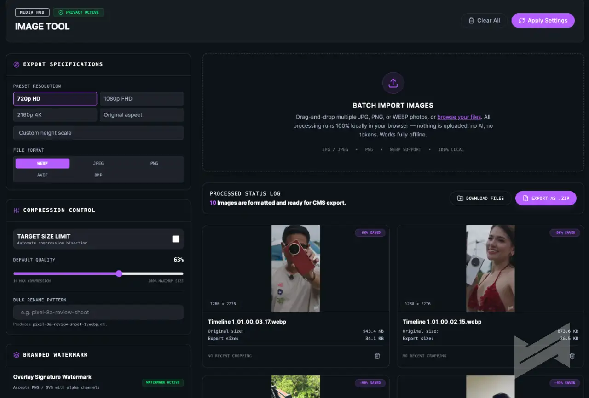

# Media Hub — Image Tool

Batch image converter, resizer, compressor, watermaker and cropper — **extracted from the Blip Media Newsroom Hub** into a standalone tool.

**Conversion to any format costs zero tokens and works fully offline.** There is no server, no AI, no API key, no analytics and no network call anywhere in this tool — every conversion happens in your browser via the native `<canvas>` encoder. Your images never leave your device.

This is an intentional design decision. We co-work with AI every day — and co-working means the AI amplifies the work, not that the work stops without it. Routine, deterministic jobs like format conversion, resizing and watermarking should never consume tokens, wait on a model, or depend on a connection. See [Token economics & offline-first values](#token-economics--offline-first-values) below.

## Quick start (no install, offline)

Open **`dist/index.html`** in any modern browser (Chrome, Edge, Firefox, Safari). That single file contains the entire app — JavaScript, styles, icons and the ZIP library — inlined. Double-click it, or drop it on a USB drive / internal server; internet is never required.

> `dist/index.html` is a committed build artifact, so you can grab it straight from the repo without installing anything.

## In action



Batch conversion above: 10 frames in, 10 WebP files out — every byte processed locally, zero tokens spent.

## Features

- **Batch import** — drag-and-drop or browse multiple JPG / PNG / WebP files
- **Output formats** — WebP, JPEG, PNG, **AVIF**, **BMP** (AVIF/BMP buttons auto-disable on browsers that cannot encode them)
- **Resolution presets** — 720p HD, 1080p FHD, 2160p 4K, original aspect, or custom height
- **Compression** — quality slider (1–100%) or **target file size** (KB) with automatic bisection-search compression
- **Bulk rename** — one slug pattern → `slug-1.webp`, `slug-2.webp`, …
- **Watermark** — upload a PNG/SVG brand mark; position (5 corners), scale and opacity controls with live placement preview
- **Crop / aspect** — draggable crop box with resize handles, rule-of-thirds grid, and social/aspect presets (16:9, 1:1, 4:3, 1.91:1, FB cover, 9:16, 4:5)
- **Export** — download individually or as one **.zip**
- Transparent images exported as JPEG/BMP get a white backdrop (no black canvas artifacts)

## Privacy guarantee

- No uploads — files are read and processed entirely in memory/on-device
- No telemetry, no fonts/CDNs fetched at runtime, no external requests of any kind
- Built with a **single-file build** (`vite-plugin-singlefile`) so there is literally no second file to fetch

## Token economics & offline-first values

Every conversion this tool runs costs **zero tokens** — a batch of 200 photos costs exactly the same as one:

- **Deterministic local code, not an AI round-trip.** Each export is a plain browser `<canvas>` encode. There is no LLM invocation, no cloud API, no agent turn and no per-image metering anywhere in the pipeline.
- **No keys, no limits, no connectivity required.** The tool carries no API keys and makes no network calls, so there are no rate limits to hit and no services to go down. It keeps working with the internet fully off — on a plane, in a venue with dead Wi-Fi, or during an AI-service outage.
- **Tokens go where judgment is needed.** Every image you convert with this tool is one fewer image that had to round-trip through an AI agent. The budget is spent on work that actually needs a thinking partner — research, drafting, analysis — instead of mechanical busywork.
- **Ready, not reliant.** AI is a collaborator, not a dependency. Workflows built on deterministic tooling keep the newsroom fast, the costs predictable, and the operation running even when the AI layer is unavailable.

The principle this tool follows: **use AI where it adds judgment; use deterministic tooling where it adds none.**

## Development

```bash
npm install
npm run dev        # local dev server (http://localhost:5173)
npm run build      # type-checks + emits the self-contained dist/index.html
```

Stack: Vite + React 19 + Tailwind CSS v4 + JSZip. UI tokens (`--color-jam-*`) live in `src/index.css` — restyle the whole tool from there.

## Format support notes

- Encoder availability is probed at startup with a real `canvas.toBlob()` test; unsupported options are shown struck-through.
- Lossy formats (JPEG/WebP/AVIF) honour the quality slider and target-size mode. PNG/BMP export losslessly.
- Safari currently cannot encode AVIF (decode only) — that button will appear disabled there.

## Browser support

All browsers with `<canvas>.toBlob()` (all modern evergreen browsers). AVIF *encoding* additionally requires Chrome 112+/Edge 112+; BMP *encoding* is available in Chrome/Edge/Firefox.

## Credits

Extracted from [Blip Media Newsroom Hub](https://github.com/gianviterbo/Blip-Media-Newsroom-Hub) — design tokens and UI kit carried over as-is.
